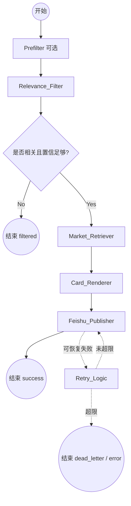

# LangGraph 编排层说明

> **范围**：只描述 [产品愿景与设计边界.md](./产品愿景与设计边界.md) 中的 **Processing Pipeline（处理编排）** 用 LangGraph 落地时的状态、节点、边与恢复策略。  
> **不写**：采集协议细节、知识库表结构全文、飞书开放平台账户申请——这些以主设计为准。

---

## 1. 编排层在仓库里的位置

主设计中的分层：

```
采集层 Ingestion          →  标准化事件 tweet.received
编排层 Processing（本文）  →  过滤 / LLM / 映射 / 组装推送载荷
知识层 Knowledge          →  板块、标的、龙头（编排层只读检索）
通知层 Notification       →  飞书发送
```

与本仓库 **当前结构** 的对应（演进时在 `main` 或独立 worker 中插入图即可）：

| 主设计概念 | 本仓库现状（约） | 编排层落地后 |
|------------|------------------|----------------|
| 采集、去重、`TweetEvent` | `ingestion/models.py`、`ingestion/timeline.py`、`ingestion/x_api.py` | 图 **入口**消费同一 `TweetEvent` 字段 |
| 轮询入口 | `main.py` 中 `poll_timeline_events` + checkpoint | 每条新 `TweetEvent` **invoke** 一次 StateGraph（或先入队再由 worker invoke） |
| 飞书发送 | `ingestion/feishu.py`（`FeishuClient`） | 编排末端节点调用 `send_text` / 卡片 API，**不负责**采集 |

**边界**：编排层 **不** 实现 X 拉取、guest token；**可**依赖 `permalink` / `raw_json` 等已填好的字段。

---

## 2. 状态定义（State Schema）

LangGraph 的全局 State 建议 `TypedDict` / Pydantic；流转中各节点读写下列字段（可在实现时拆子结构）。

| 字段 | 类型 | 说明 |
|------|------|------|
| `tweet_id` | `str` | 推文唯一标识；**幂等**与去重主键（对齐主设计 §4.1、`TweetEvent.id`） |
| `raw_text` | `str` | 正文；进入「语义网关」与后续 LLM |
| `permalink` | `str` | 原文链接；飞书必带（对齐 `TweetEvent.permalink`） |
| `author_username` | `str` | 来源展示（如 `business`） |
| `analysis` | `dict` | **LLM 结构化结果**：`is_relevant`、多标签 `themes`、`sentiment`、`confidence` 等；与主设计 §5 的 `relevance` / `sentiment` 可同构或拆子字段 |
| `market_map` | `dict` | **检索输出**：主题 → 板块/标的 **候选**（Top-K），来自知识层；**终态映射**写入下栏 |
| `market_impact` | `dict` | 可选：与 §5 一致的 `sectors[]`、`stocks[]`、`mapping_confidence`，供卡片渲染 |
| `status` | `str` | 如 `success` / `filtered` / `error`；或细分子阶段便于日志 |
| `retry_count` | `int` | 推送等可恢复步骤共用 |
| `feishu_payload` | `dict \| str` | `Card_Renderer` 产物：卡片 JSON 或已格式化的文本 |

说明：

- **`analysis` 与主设计 §5**：当前 MVP 为扁平归一化 dict（见 `pipeline/deepseek._normalize_payload`）；主设计 §5 大 JSON 为终态目标，后续可再映射 `relevance` / `market_impact` 等。
- **`graph thread_id`**：本仓库实现为 **`f"{source}:{tweet_id}"`**（`TweetEvent.source` + `TweetEvent.id`，见 `pipeline/graph.py`），避免 X / 财联社等不同源 id 冲突；与 Checkpointer 组合时仍保证「同事件」单线程语义。

---

## 3. 节点详细设计（在原架构上优化）

### 3.1 `Prefilter`（可选，主设计 Stage A）

- **职责**：极轻量规则/词典/语言，**只**挡明显无关推，降本；**不**替代主 LLM。
- **输入**：`raw_text`。
- **输出**：更新 `status`；若不通过则后续不再调用大模型。

### 3.2 `Relevance_Filter`（语义网关，主设计 Stage B）

- **职责**：**主路径 LLM**——是否与中国宏观、AI、半导体、光模块等相关；输出 **结构化 JSON**（键约定见 `pipeline/prompts/triage_system.txt`），含 **置信度**；归一化写入 `analysis`。
- **输入**：`raw_text`。
- **逻辑**：
  - 多标签 + `confidence`（阈值如 >0.7 视为相关，可配置）；
  - **同一调用**带出 **情绪**（对**叙事/标的**，非对作者），见主设计 §4.3。
- **输出**：写入 `analysis`（及对应的 `sentiment` 字段）。

### 3.3 `Market_Retriever`（知识库检索 + 映射消解）

- **职责**（对齐主设计 §4.4）：由 `analysis` 中主题/短语，在 **Leaders_DB / 板块库** 做关键词或向量检索，得到 `market_map`（候选）；**再在候选集合内**做第二次 LLM 或规则融合，产出 `market_impact`，避免模型幻觉代码。
- **输出**：更新 `market_map`、`market_impact`；`mapping_confidence` 低时允许继续推送但在卡片标注「不确定」（主设计 §4.2 / §4.5）。

> 实现上可将「仅检索」与「候选内消解」拆成两个节点；**编排语义**上仍归属 **`Market_Retriever`** 阶段。

### 3.4 `Card_Renderer`（通知格式化）

- **职责**：把 `analysis`、`market_impact`、`permalink` 编成飞书 **交互卡片** 或富文本；情绪驱动标题色（利好/利空/中性，与产品约定一致，注意 A 股配色习惯）。
- **输出**：`feishu_payload`。

### 3.5 `Feishu_Publisher`

- **职责**：调用 `FeishuClient`（与本仓库 `ingestion/feishu.py` 对齐）；失败时抛错由重试边处理。
- **幂等**：业务上以 `tweet_id` 为去重键（主设计 §4.5：`update_key` 或表 `sent_notifications`）。

---

## 4. 流程编排与路由（Graph Topology）

### 4.1 逻辑流转图



未启用 `Prefilter` 时：`START --> A`。

**本仓库当前默认（与上图差异）**：`pipeline/graph.py` 中 **未** 在边里插入 `Market_Retriever`；实际边为 `relevance_filter → body_translate → card_renderer → feishu_publisher`（`Market_Retriever` 为预留，见代码注释）。上图表示目标拓扑，接入龙头映射后可在 `relevance_filter` 与 `body_translate` 之间插入该节点。

### 4.2 条件边（Conditional Edges）

| 规则 | 行为 |
|------|------|
| `Relevance_Filter` 判定无关或 `confidence` 低于阈值 | 直达 **END**，`status=filtered`，不跑检索与推送 |
| `mapping_confidence` 较低 | **可选**路由到人工审核（V2）；MVP 可继续在 `Card_Renderer` 打「映射不确定」 |
| `Feishu_Publisher` 返回 5xx / 429 / 网络可恢复错误 | `Retry_Logic`：`retry_count++`，退避后回 **E** |
| Schema 校验失败、业务 4xx | **不重试**或进 DLQ，避免死循环 |

---

## 5. 编排层关键机制（精炼）

| 主题 | 约定 |
|------|------|
| **Checkpointer** | **当前默认**：`langgraph.checkpoint.memory.MemorySaver`（`TweetPipelineCompiler`）；单机进程内重放。生产可换 `SqliteSaver` / `PostgresSaver`，便于推送失败后从「渲染完成之后」恢复、减少重复耗 Token。 |
| **幂等** | `tweet_id`；与采集层 `seen_ids`/checkpoint **分工**：采集防重复拉取，编排/通知防重复推送 |
| **知识库** | 版本化 Leaders_DB 形态、行业字段详见 **主设计 §4.4**；编排层只约定 State 里 `market_map` / `market_impact` 的职责 |
| **可观测** | 每节点打结构化日志：`tweet_id`、`status`、耗时；指标见主设计 §6 |

---

## 6. 与主设计的追踪关系

| 本文件节点/字段 | 主设计章节 |
|------------------|------------|
| `TweetEvent` 入图字段 | §4.1 最小字段 |
| `Prefilter` + `Relevance_Filter` | §4.2 两阶段 |
| `analysis` 内情绪 | §4.3 |
| `Market_Retriever` | §4.4 |
| `Card_Renderer` + `Feishu_Publisher` | §4.5 |
| 最终 JSON 形状 | §5 Schema |
| 合规与免责声明文案 | §7 |

若冲突，**以 [产品愿景与设计边界.md](./产品愿景与设计边界.md) 为准**。

---

## 7. 实施阶段（编排视角）

| 阶段 | 内容 |
|------|------|
| **Phase 1（MVP）** | `Relevance_Filter` → `Card_Renderer`（可先文本）→ `Feishu_Publisher`；弱映射或静态 JSON |
| **Phase 2** | 完整 `Market_Retriever`（检索 + 候选内消解）+ 飞书卡片 + 置信度门槛 |
| **Phase 3** | `Prefilter`、人工审核节点、DLQ 与多账号并行度（队列 + 多 worker） |

---

**实现锚点**：编排已由 `pipeline/graph.py` 的 `TweetPipelineCompiler` 构建 `StateGraph`，`main.py` 在每条 `TweetEvent` 上调用 `invoke_for_tweet`；LangGraph / LangChain 具体 API 以依赖版本为准。
