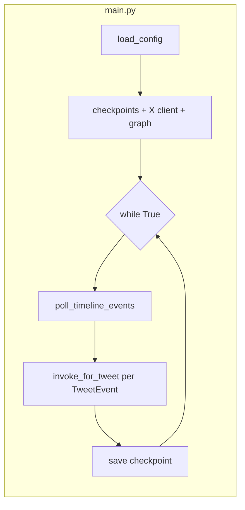

# 项目架构说明（入口：`main.py`）

本文档按当前代码结构整理：**长期运行入口**为根目录 `main.py`，负责 X 时间线轮询、断点持久化，并将每条新推文交给 **LangGraph 编排层**（DeepSeek 分析 → 卡片渲染 → 飞书）。产品背景与分阶段规划仍以仓库内 [bloomberg_twitter_agent_design.md](../bloomberg_twitter_agent_design.md) 为准；安装与部署见 [README.md](../README.md)。

---

## 1. 总览

| 层级 | 包 / 文件 | 职责 |
|------|-----------|------|
| **应用入口** | `main.py` | 读配置、建 X 客户端与飞书客户端、编译 LangGraph、按账号轮询时间线、调用 `invoke_for_tweet` |
| **采集层** | `ingestion/` | X GraphQL 客户端、时间线轮询、checkpoint、配置加载、`TweetEvent` 标准化 |
| **编排层** | `pipeline/` | LangGraph `StateGraph`、DeepSeek 相关性分析、卡片文本、飞书发布与重试 |
| **配置** | `config.toml` | `[x]`、`[poll]`、`[feishu]`、`[llm]`；路径可由环境变量 `NEWS_AGENT_CONFIG` 覆盖 |

可选依赖：`pip install -e ".[pipeline]"` 安装 LangGraph / LangChain / `langchain-deepseek`（`main.py` 固定走 pipeline）。

### 1.1 核心文件索引（不含 venv）

| 路径 | 说明 |
|------|------|
| `main.py` | 轮询入口：`AccountPollRuntime`、`_bootstrap_accounts`、`_poll_one_account`、`_run_pipeline_for_events` |
| `setup.py` | 包声明；`extras_require["pipeline"]` 为 LangGraph 栈 |
| `ingestion/config.py` | `load_config` → `AppConfig` |
| `ingestion/x_api.py` | `XClient`、`create_x_client`、GraphQL 拉取与重试 |
| `ingestion/timeline.py` | `poll_timeline_events`、`format_events_message` |
| `ingestion/checkpoints.py` | `PollCheckpointStore`（JSON 断点） |
| `ingestion/models.py` | `TweetEvent`、`pipeline_initial_state` |
| `ingestion/feishu.py` | `FeishuClient` |
| `pipeline/graph.py` | `TweetPipelineCompiler`（节点注册 / 边连接）、`PipelineCompileConfig.from_app`、`build_pipeline_graph*`、`invoke_for_tweet` |
| `pipeline/nodes.py` | 各节点；`_llm_failure_update` / `_analysis_stub_no_llm` 等内部辅助 |
| `pipeline/deepseek.py` | `TweetTriageAnalyzer`、LLM 解析与归一化 |
| `pipeline/state.py` | `PipelineState` |
| `tests/` | `test_pipeline_graph`、`test_feishu` |
| `llm_schema.py` | 设计用分析 JSON 形状说明（非运行时代码依赖） |

---

## 2. 入口 `main.py` 执行流程

1. **`load_config()`**（`ingestion.config`）加载 TOML，得到 `AppConfig`（含 X、轮询、飞书、LLM）。
2. **`PollCheckpointStore`**（`ingestion.checkpoints`）读写 `poll.checkpoint_file`（默认 `checkpoints.json`），按账号保存 `since_id`。
3. **`create_x_client()`**（`ingestion.x_api`）创建 X 客户端；**`_bootstrap_accounts`** 对每个 `poll.targets` 解析 `user_id` 并构造 **`AccountPollRuntime`**（`since_id` + 内存 **`seen_ids`**）。
4. **主循环**（间隔 `poll.interval_sec`，默认 5 秒），每账号由 **`_poll_one_account`** 完成：
   - **`poll_timeline_events`**：拉取新帖、`seen_ids` 去重、产出 **`List[TweetEvent]`**，更新 **`AccountPollRuntime.since_id`**。
   - **`_run_pipeline_for_events`** → **`invoke_for_tweet`**：每条事件跑 LangGraph，打印 `status` / `error`。
   - 若有新的 `since_id`，写回 checkpoint 文件。

异常策略：单账号轮询失败仅打印并跳过；单条 pipeline 失败打印错误，不阻塞同轮其它推文。



---

## 3. 采集层 `ingestion/`

| 模块 | 作用 |
|------|------|
| `config.py` | `load_config` → `AppConfig`（`XConfig`、`PollConfig`、`FeishuConfig`、`LlmConfig`）；密钥优先读环境变量（如 `DEEPSEEK_API_KEY`、`FEISHU_*`） |
| `x_api.py` | X Web GraphQL 封装：`XClient`、用户时间线拉取、重试；`create_x_client()` 从全局配置构造客户端 |
| `timeline.py` | `poll_timeline_events`：首次仅建 `since_id`、后续增量拉取；`format_events_message` 人类可读日志 |
| `checkpoints.py` | `PollCheckpointStore`：JSON 文件持久化各账号 `since_id` |
| `models.py` | **`TweetEvent`** 标准事件；**`pipeline_initial_state()`** 生成与 `PipelineState` 键名一致的初始字典 |
| `feishu.py` | `FeishuClient`：应用凭证换 token、发 IM；`main.py` 在 `feishu.enabled` 时注入 graph |

---

## 4. 编排层 `pipeline/`

### 4.1 状态 `state.py`

**`PipelineState`**（`TypedDict`）贯穿全图。初始字段由 `TweetEvent.pipeline_initial_state()` 填入；`relevance_filter` 节点写入 **`analysis`**（见下）。

要点：

- `raw_text` / `tweet_id` / `permalink` 等与 `TweetEvent` 一一对应。
- `analysis` 中含 **`is_relevant`**（严格：监控领域 + 市场影响）、**`broad_push_eligible`**（宽松：实质涉 AI 或中国）、**`confidence`**、`themes`、`keywords`、`sentiment` 等（由 `deepseek.py` 归一化）。

### 4.2 图编译与调用 `graph.py`

- **`PipelineCompileConfig`**：构图参数；**`from_app(app, feishu_client=...)`** 从 `load_config()` 推导 `llm` / 飞书 dry_run。
- **`TweetPipelineCompiler(cfg)`**：`_register_nodes`、`_wire_entry_and_relevance`、`_wire_publish_and_retry` 后 **`compile()`**；条件边集中在 **`_EdgeRouter`** 静态方法。
- **`build_pipeline_graph` / `build_pipeline_graph_from_app`**：对编译器的薄封装。
- **`invoke_for_tweet(ev, graph=...)`**：`tweet_event_to_state(ev)` → `invoke`，`thread_id` 为 `tweet:{id}`。

### 4.3 节点 `nodes.py`（与图边）

当前默认路径（未启用 `enable_prefilter` 时）：

`START` → **`relevance_filter`** →（条件边）→ **`body_translate`** → `card_renderer` → `feishu_publisher` →（成功 `END` / 失败退避重试）。

- **`relevance_filter`**：`make_relevance_filter` 工厂注入 `TweetTriageAnalyzer`（`deepseek.py`）。放行条件：**（`is_relevant` 且 `confidence` ≥ 阈值）或 `broad_push_eligible`**；否则 `status: filtered`，图在条件边处结束。
- **`body_translate`**：`make_body_translate_node`；对判定为英文的正文调用 **`TweetBodyZhTranslator`** 写入 **`raw_text_zh`**（无 LLM 或非英文则跳过）。
- **`card_renderer`**：根据 `analysis`、`raw_text_zh` 等拼飞书文本（含「原文摘录」「中文译文」），写入 `feishu_payload`。
- **`feishu_publisher`**：工厂节点，调用 `FeishuClient`；失败时 `publish_status` 驱动重试边。
- **`market_retriever`**：在 `graph.py` 中仍注释掉，预留与 `market_map` / `market_impact` 对接。

条件路由 **`_EdgeRouter.after_relevance`**：仅当节点返回 **`status == "filtered"`** 时走向 `END`，与节点内放行规则一致。

### 4.4 LLM `deepseek.py`

- **`TweetTriageAnalyzer`**：`init_chat_model`（DeepSeek、JSON 输出模式），解析模型 JSON，**`_normalize_payload`** 写入 `analysis`。
- 每次分析在标准输出打印 **`user` 消息与模型原始 `output`**（不打印 system prompt）。

---

## 5. 端到端数据流（概念）

```
X API / timeline
    → dict 推文
    → normalize_post_to_event → TweetEvent
    → pipeline_initial_state() → PipelineState 初始
    → LangGraph：relevance_filter（DeepSeek）→ body_translate（英译中）→ card_renderer → feishu_publisher
    → 飞书 IM（若已配置且非 dry_run）
```

---

## 6. 配置与环境变量摘要

| 配置块 | 用途 |
|--------|------|
| `[x]` | Bearer、代理、超时、GraphQL `query_id` |
| `[poll]` | `targets`、`interval_sec`、`max_results`、`checkpoint_file` |
| `[feishu]` | 应用发消息；可用 `FEISHU_*` 环境变量覆盖 |
| `[llm]` | DeepSeek；`DEEPSEEK_API_KEY` 优先于文件内 `api_key` |

---

## 7. 扩展与阅读顺序

- 调整**是否推送**：改 `pipeline/deepseek.py` 的 prompt 与字段语义，或改 `nodes.make_relevance_filter` / `graph.PipelineCompileConfig` 的阈值与路由。
- 恢复**市场映射节点**：在 `graph.py` 取消注释 `market_retriever` 相关边，并实现 `nodes.node_market_retriever` 与下游消费。
- **设计对照**：`ingestion/models.py`、`pipeline/state.py` 文档字符串与 `bloomberg_twitter_agent_design.md` 中的事件与状态约定。

---

*文档生成依据仓库当前代码；若接口变更，请以源码为准。*
